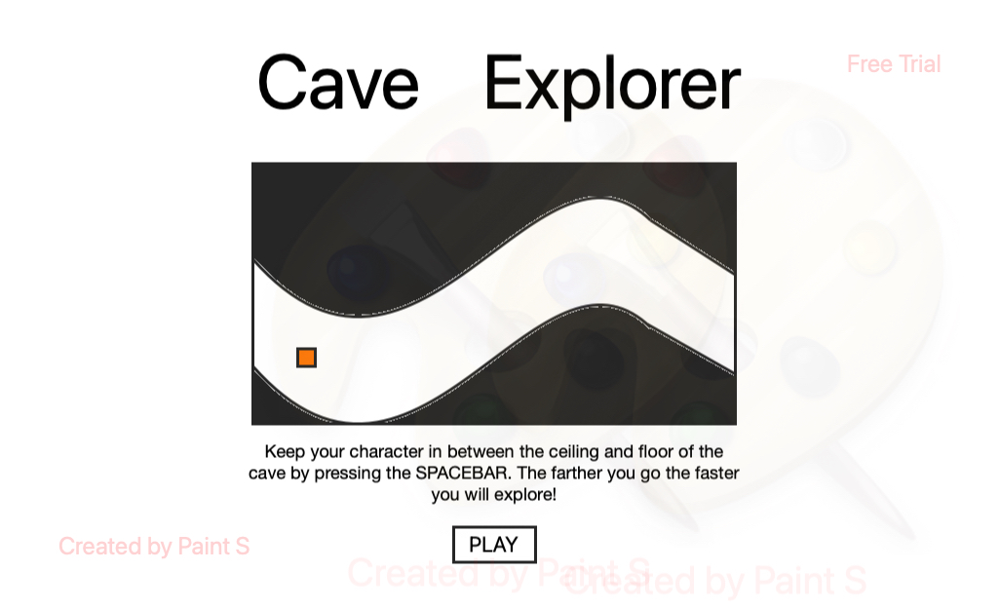

# Cave Explorer
link to game: https://brogers-97.github.io/Project-1/
## Time to Explore!
You are a bueatiful dot who wants nothing more than to explore a massive cave. Unfortunately gravity is not being very helpful to you (idk why it won't just help you, but whatever.) You need to avoid hitting ceilings and falling to your death, but lukily, your desire to explore overcomes the fear of death. 

## Instructions

Keep your dot floating by hitting the spacebar. The farther in you go the quicker you will move, making it harder to predict and adjust to the steep falls and climbs of the cave walls. 

---
## MVP
* Create a an object (square or circle) that can be linked to the space bar for vertical movements
* Have a game menu with a preview of the game play, instructions and a functional play button
* Randomly generate columns with their collision information
* Create collision info for character that stays with it while it goes up and down
* As the player gets farther, the tunnel should also shrink, increasing the difficulty
* Create interval that will generate the new columns on right side of screen and push current columns to the left 
* Have a score board outside of the canvas that will be a marker for player progress
* Game Over function that will end game upon colliding with walls
* Reset button that will put the player back at the beginning
## Stretches
* Keep the highscore from previous games
* Decorate the outside of canvas to look like the inside of a cave
* Have optional characters to play with
* Create a background in the cave for user experience (in lou of just a colored background)
* Create an interval that will speed up game over time
* Add background music to give a more immersive style
## Potential roadblocks
* the cave needs to be fluid, meaning it will go up a little ways before going down. The auto column generating needs to be able to do this.
* have the character appear to be affected by gravity could be tough as well, it will be better the more natural it looks.